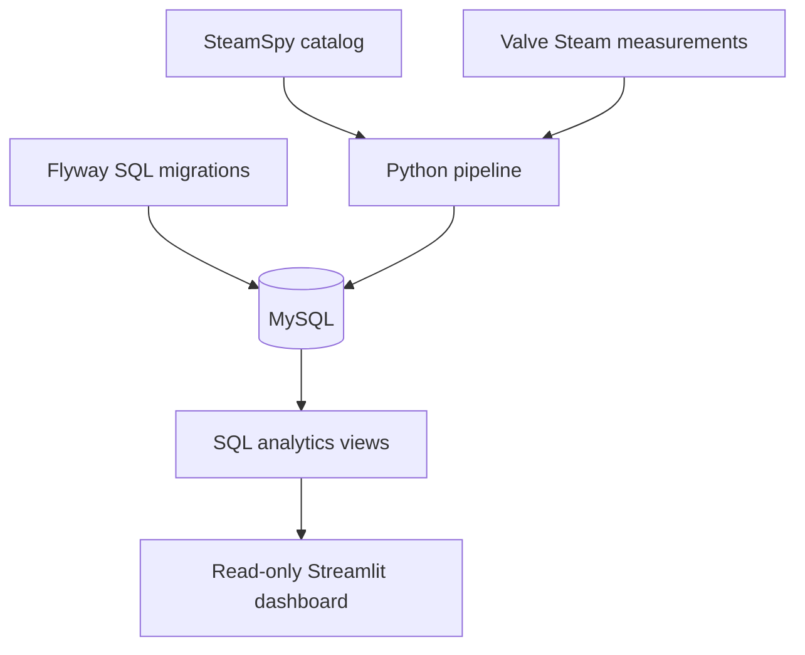

# Steam Data Pipeline

A Dockerized data pipeline that extracts a SteamSpy game catalog plus focused measurements from Valve's Steam endpoints, validates and transforms them with Python, stores historical observations in MySQL, and presents SQL-driven analytics in a Streamlit dashboard.

The project is designed as a practical data-engineering portfolio project, with reproducible deployment, database migrations, audit history, data-quality checks, automated tests, and separate database permissions.

## Architecture



Docker Compose manages these services:

- `mysql` — persistent database.
- `db-bootstrap` — creates or repairs the read-only dashboard account.
- `migration-assets` — copies migrations from the application image.
- `migrate` — applies pending Flyway migrations and exits.
- `scheduler` — runs the pipeline daily.
- `pipeline` — optional one-shot manual collection.
- `dashboard` — provides the interactive analytics interface.

Startup order is enforced:

```text
MySQL healthy → bootstrap and migrations complete → scheduler and dashboard start
```

## Features

- SteamSpy API extraction with retry and exponential backoff.
- Validation and transformation of 1,000 games per configured API page.
- Append-only historical metric snapshots.
- Valve current-player measurements for top-100 games present on the configured
  catalog page, plus Steam review measurements for configured app IDs.
- Audited pipeline runs with success/failure status.
- SQL window functions for changes between snapshots.
- Versioned and repeatable Flyway migrations.
- Read-only dashboard database account.
- Docker-managed persistent storage.
- Non-root Python containers.
- Automated unit tests without live API requests.
- Linux, macOS and Windows-compatible Docker Compose workflow.

## Technology

- Python 3.12
- Pandas
- Requests
- MySQL 8.0
- Flyway
- Streamlit
- Plotly
- Docker Compose
- `unittest`

## Data model

### `games`

Relatively stable game metadata:

- App ID and name
- Developer and publisher
- Languages and genre
- First and most recent appearance in the extraction

### `game_metric_snapshots`

Append-only SteamSpy values for each pipeline run. `snapshot_time` is the
collection time; SteamSpy does not expose the underlying source measurement
time:

- Owner estimate range and midpoint
- Positive and negative reviews
- Review score
- Lifetime and recent playtime
- SteamSpy-reported `ccu` (the source measurement time is unknown)
- Current and original price
- Discount percentage

### `steam_game_measurements`

Focused observations from Valve endpoints:

- Current players and rank for Valve's top 100 concurrent games that are also
  present on the configured SteamSpy catalog page
- Direct current-player measurements for configured tracked games outside the
  top 100
- Steam Store review totals for tracked games, across all languages and
  purchase types and including off-topic activity
- Explicit collection time
- Valve's source measurement time for the top-100 feed; direct calls retain a
  null source time and use collection time as the chart fallback

The Valve calls are intentionally limited to `STEAM_TRACKED_APPIDS`. The
default is Counter-Strike (`730`), Factorio (`427520`), and Portal 2 (`620`),
which adds review requests only for those games. The top-100 player coverage is
one bulk request per daily run.

The source contract is:

- Catalog and owner estimates:
  `https://steamspy.com/api.php?request=all&page=<page>`
- Current players:
  `ISteamChartsService/GetGamesByConcurrentPlayers/v1/` for the top 100, then
  `ISteamUserStats/GetNumberOfCurrentPlayers/v1/?appid=<appid>`
  for configured games outside the top 100
- Review summary:
  `https://store.steampowered.com/appreviews/<appid>` with `filter=recent`,
  `language=all`, `review_type=all`, `purchase_type=all`,
  `filter_offtopic_activity=0`, and one returned review

### `pipeline_runs`

Operational audit information:

- Start and finish timestamps
- Status
- Rows extracted and loaded
- Failure message

All database timestamps are stored in UTC. The dashboard converts displayed run times to `Europe/Prague`.

## SQL analytics

The project includes views for:

- Latest successful pipeline run
- Current metrics from that run
- Top games by estimated owners
- Best-reviewed games
- Games with the highest SteamSpy-reported CCU
- Free, paid and unknown-price comparisons
- Publisher summaries
- Historical game trends
- Changes between consecutive snapshots using `LAG()`
- Daily pipeline reliability

Views contain reusable analytical logic. Final dashboard queries control sorting and row limits explicitly.

## Project structure

```text
.
├── db
│   ├── init
│   │   └── 01_create_dashboard_user.sh
│   └── migrations
│       ├── R__analytics_views.sql
│       ├── V1__initial_schema.sql
│       └── V2__steam_measurements.sql
├── src
│   ├── api
│   │   └── steam_api.py
│   ├── database
│   │   └── mysql_database.py
│   ├── quality
│   │   └── data_quality.py
│   ├── transform
│   │   └── data_transformer.py
│   ├── config.py
│   ├── dashboard.py
│   ├── main.py
│   └── scheduler.py
├── tests
│   ├── test_scheduler.py
│   ├── test_steam_api.py
│   └── test_transform.py
├── .env.example
├── CHANGELOG.md
├── docker-compose.yml
├── Dockerfile
├── requirements.txt
└── README.md
```

## Prerequisites

Install:

- Git
- Docker
- Docker Compose

No local Python installation, MySQL server, or MySQL Workbench is required.

Verify:

```bash
git --version
docker --version
docker compose version
```

## Linux setup

Clone the repository:

```bash
git clone https://github.com/infish/steam-data-pipeline.git
cd steam-data-pipeline
```

Create the private configuration file:

```bash
cp .env.example .env
```

Generate three separate passwords:

```bash
openssl rand -hex 24
openssl rand -hex 24
openssl rand -hex 24
```

Open `.env` and assign them to:

- `MYSQL_ROOT_PASSWORD`
- `PIPELINE_DB_PASSWORD`
- `DASHBOARD_DB_PASSWORD`

Never commit `.env`. It is excluded by both Git and Docker.

Collection settings use these defaults:

| Variable | Default | Meaning |
| --- | --- | --- |
| `STEAMSPY_MODE` | `all` | SteamSpy catalog request |
| `STEAMSPY_PAGE` | `0` | SteamSpy catalog page |
| `STEAM_TRACKED_APPIDS` | `730,427520,620` | App IDs enriched with reviews and direct player fallback |
| `PIPELINE_TIMEZONE` | `Europe/Prague` | Daily scheduler timezone |
| `PIPELINE_RUN_HOUR` | `20` | Daily local run hour |
| `PIPELINE_RUN_MINUTE` | `0` | Daily local run minute |
| `PIPELINE_RUN_ON_STARTUP` | `false` | Optional immediate collection on scheduler startup |

Keep `PIPELINE_RUN_ON_STARTUP=false` for persistent deployments. Container
restarts otherwise create extra observations unrelated to the daily schedule.

## Start the complete project

```bash
docker compose up --build -d
```

Check service states:

```bash
docker compose ps -a
```

Expected lifecycle:

- MySQL: running and healthy.
- Flyway: exited with code `0`.
- Scheduler: running and waiting for the configured daily time.
- Pipeline: absent unless a manual run was requested.
- Dashboard: running and healthy.

Open the dashboard:

[http://localhost:8501](http://localhost:8501)

The Compose port mapping publishes the dashboard on port `8501` on all host
interfaces. Restrict it with a firewall or change the mapping to
`127.0.0.1:8501:8501` if it should only be reachable locally.

## Run another snapshot

```bash
docker compose run --rm pipeline
```

This applies pending migrations, refreshes the configured SteamSpy catalog
page, and appends Valve measurements for the tracked app IDs.

The scheduler runs once daily. It does not collect on container startup, which
avoids duplicate observations during app restarts. Manual runs remain available
for focused validation.

## View logs

```bash
docker compose logs pipeline
docker compose logs dashboard
docker compose logs mysql
```

Follow dashboard logs continuously:

```bash
docker compose logs -f dashboard
```

## Stop the project

```bash
docker compose down
```

The MySQL named volume remains intact.

To intentionally delete the development database and recreate it from scratch:

```bash
docker compose down -v
```

Warning: `-v` permanently deletes all snapshots stored in the Docker volume.

## Query MySQL without Workbench

Open the MySQL command-line client as the pipeline account:

```bash
docker compose exec mysql sh -c \
  'MYSQL_PWD="$MYSQL_PASSWORD" mysql -u"$MYSQL_USER" "$MYSQL_DATABASE"'
```

Example SQL:

```sql
SELECT COUNT(*)
FROM current_game_metrics;

SELECT
    games.name,
    measurements.collected_at,
    measurements.source_measured_at,
    measurements.current_players,
    measurements.total_reviews
FROM steam_game_measurements AS measurements
JOIN games ON games.appid = measurements.appid
ORDER BY measurements.collected_at DESC
LIMIT 20;
```

Exit the MySQL client with:

```text
exit
```

## Database migrations

Flyway reads SQL from:

```text
db/migrations/
```

Migration types:

- `V1__description.sql` — versioned migration, executed once.
- `V2__description.sql` — next schema change.
- `R__description.sql` — repeatable migration, rerun when its contents change.

Do not edit an already-applied versioned migration. Create the next numbered migration instead.

## Run automated tests

Tests run inside the application image and do not require local Python packages:

```bash
docker compose run --build --rm --no-deps \
  -e PYTHONPATH=/app/src \
  pipeline \
  python -m unittest discover -s tests -v
```

The API tests use mocks and never contact SteamSpy or Valve endpoints.

## Security

- MySQL is not published to the host network.
- Database files live in a Docker named volume.
- Credentials are stored in an ignored `.env` file.
- The dashboard uses an account restricted to `SELECT` and `SHOW VIEW`.
- Arbitrary SQL input is not accepted by the dashboard.
- Streamlit accepts connections on the container network; the host-side port
  mapping determines where the dashboard is exposed.
- Python services run as an unprivileged container user.

Do not expose the Streamlit port directly to the public internet. Use an authenticated reverse proxy or a private network such as Tailscale if remote access is required.

## Stale-data incident: September 2026

The original pipeline treated every successful SteamSpy response as a fresh
measurement. That was incorrect. Both SteamSpy's bulk and per-app endpoints
returned unchanged values across repeated collections, while the database gave
each response a new `snapshot_time`. The timestamp represented collection time,
not the time SteamSpy measured the underlying value. As a result, the dashboard
plotted flat series that looked current even though the source values were
stale. For example, 7 Days to Die repeatedly displayed SteamSpy `ccu` of
`17,045` while Valve reported roughly `29,000` current players during diagnosis.

The first correction added authoritative Valve measurements for three test
games, but the dashboard still exposed the legacy SteamSpy chart for every
catalog game. Games outside that initial set therefore continued to show the
same misleading flat series. The completed correction:

- collects Valve's top-100 concurrent-player feed once per run;
- uses direct Valve player lookups for configured games outside that feed;
- records Valve's source timestamp when the feed supplies one;
- keeps collection time separate and uses it only as an explicit fallback;
- charts only Valve measurements while retaining SteamSpy snapshots for audit;
- avoids fabricating or backfilling historical Valve values.

Duplicate observations had two scheduling causes. The scheduler originally ran
on container startup, and its single long sleep could wake fractionally before
the intended deadline and run twice. A separate user-level systemd timer was
also invoking the manual pipeline alongside the Compose scheduler. Startup
collection is now disabled, the scheduler rechecks its deadline after waking,
and the duplicate local systemd timer was disabled. Persistent deployments
should run exactly one scheduling mechanism.

## Data limitations

SteamSpy remains useful for catalog metadata and broad comparisons, but its
values are not treated as authoritative time-series measurements.

Important limitations:

- `owners` is an estimated range.
- The midpoint is useful for comparisons but is not an exact count.
- Owned copies are not equivalent to sales.
- SteamSpy does not provide source measurement timestamps. `snapshot_time` is
  only when this pipeline collected the response, and a successful response
  does not establish freshness.
- Valve's current-player endpoint may be cached upstream for a short interval.
- Valve supplies `source_measured_at` for its top-100 player feed. Direct player
  and review-summary calls do not include a source timestamp, so charts fall
  back to the explicitly labeled `collected_at` value for those observations.
- Steam review totals use `language=all`, `purchase_type=all`, and
  `filter_offtopic_activity=0`. Moderation or classification changes can make
  totals decrease as well as increase.
- Recently released and low-ownership games may have unreliable estimates.
- `request=all` returns 1,000 games per page and is rate-limited.

The dashboard warns when the latest three values of a selected Valve metric are
identical. Legacy SteamSpy snapshots remain queryable for audit purposes but
are no longer charted because their collection timestamps do not establish
freshness.

Run exactly one scheduler. The Compose `scheduler` is the supported default;
disable any older cron or systemd timer that also invokes the manual `pipeline`
service.

These limitations should be considered when interpreting charts and derived metrics.

## TrueNAS SCALE deployment

The project can be deployed on TrueNAS SCALE as a single Custom App using the
**Install via YAML** interface.

### Architecture

The TrueNAS deployment runs:

- MySQL 8 with persistent storage
- a one-shot database bootstrap service
- Flyway migrations
- a persistent Python scheduler
- the Streamlit dashboard
- an optional manual one-shot pipeline service

The application image is pulled from:

```text
ghcr.io/infish/steam-data-pipeline:latest
```

Before installing `deploy/truenas-compose.yml`:

1. Replace all three `CHANGE_ME_*` password placeholders with distinct strong
   values.
2. Confirm `/mnt/Apps/steam-data-pipeline/mysql` is the intended persistent
   dataset path.
3. Keep the tracked app list small and leave startup collection disabled.

Paste the resulting YAML into the Custom App editor and deploy it. Flyway
applies additive migrations before the scheduler and dashboard start. Updating
the app recreates containers but preserves the MySQL host-path data.
