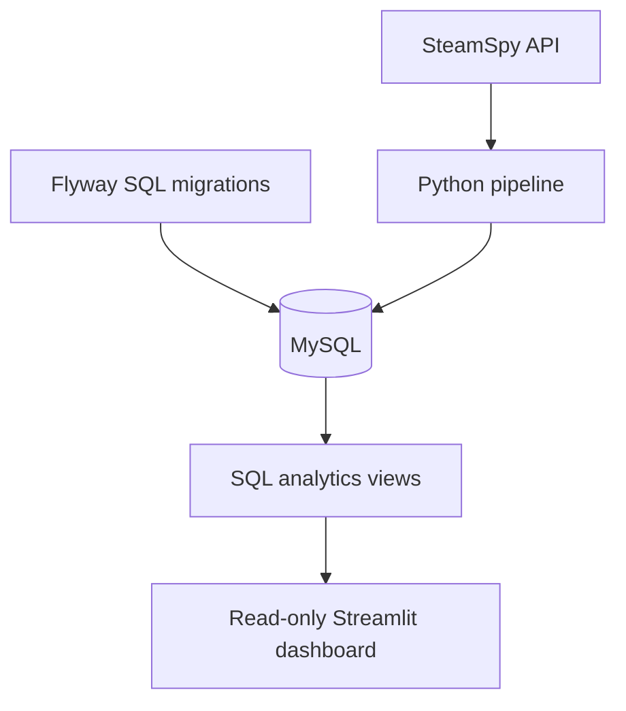

# Steam Data Pipeline

A Dockerized data pipeline that extracts Steam game statistics from the SteamSpy API, validates and transforms them with Python, stores historical snapshots in MySQL, and presents SQL-driven analytics in a Streamlit dashboard.

The project is designed as a practical data-engineering portfolio project, with reproducible deployment, database migrations, audit history, data-quality checks, automated tests, and separate database permissions.

## Architecture



Docker Compose manages four services:

- `mysql` — persistent database.
- `migrate` — applies pending Flyway migrations and exits.
- `pipeline` — extracts and loads one snapshot, then exits.
- `dashboard` — provides the interactive analytics interface.

Startup order is enforced:

```text
MySQL healthy → migrations complete → pipeline complete → dashboard starts
```

## Features

- SteamSpy API extraction with retry and exponential backoff.
- Validation and transformation of 1,000 games per configured API page.
- Append-only historical metric snapshots.
- Audited pipeline runs with success/failure status.
- SQL window functions for changes between snapshots.
- Versioned and repeatable Flyway migrations.
- Read-only dashboard database account.
- Docker-managed persistent storage.
- Non-root Python containers.
- Automated unit tests without live API requests.
- Linux, macOS and Windows-compatible Docker Compose workflow.

## Technology

- Python 3.12
- Pandas
- Requests
- MySQL 8.0
- Flyway
- Streamlit
- Plotly
- Docker Compose
- `unittest`

## Data model

### `games`

Relatively stable game metadata:

- App ID and name
- Developer and publisher
- Languages and genre
- First and most recent appearance in the extraction

### `game_metric_snapshots`

Append-only measurements for each pipeline run:

- Owner estimate range and midpoint
- Positive and negative reviews
- Review score
- Lifetime and recent playtime
- Yesterday’s peak concurrent users
- Current and original price
- Discount percentage

### `pipeline_runs`

Operational audit information:

- Start and finish timestamps
- Status
- Rows extracted and loaded
- Failure message

All database timestamps are stored in UTC. The dashboard converts displayed run times to `Europe/Prague`.

## SQL analytics

The project includes views for:

- Latest successful pipeline run
- Current metrics from that run
- Top games by estimated owners
- Best-reviewed games
- Games with the highest yesterday-peak CCU
- Free, paid and unknown-price comparisons
- Publisher summaries
- Historical game trends
- Changes between consecutive snapshots using `LAG()`
- Daily pipeline reliability

Views contain reusable analytical logic. Final dashboard queries control sorting and row limits explicitly.

## Project structure

```text
.
├── db
│   ├── init
│   │   └── 01_create_dashboard_user.sh
│   └── migrations
│       ├── R__analytics_views.sql
│       └── V1__initial_schema.sql
├── src
│   ├── api
│   │   └── steam_api.py
│   ├── database
│   │   └── mysql_database.py
│   ├── quality
│   │   └── data_quality.py
│   ├── transform
│   │   └── data_transformer.py
│   ├── config.py
│   ├── dashboard.py
│   └── main.py
├── tests
│   ├── test_steam_api.py
│   └── test_transform.py
├── .env.example
├── docker-compose.yml
├── Dockerfile
├── requirements.txt
└── README.md
```

## Prerequisites

Install:

- Git
- Docker
- Docker Compose

No local Python installation, MySQL server, or MySQL Workbench is required.

Verify:

```bash
git --version
docker --version
docker compose version
```

## Linux setup

Clone the repository:

```bash
git clone https://github.com/infish/steam-data-pipeline.git
cd steam-data-pipeline
```

Create the private configuration file:

```bash
cp .env.example .env
```

Generate three separate passwords:

```bash
openssl rand -hex 24
openssl rand -hex 24
openssl rand -hex 24
```

Open `.env` and assign them to:

- `MYSQL_ROOT_PASSWORD`
- `PIPELINE_DB_PASSWORD`
- `DASHBOARD_DB_PASSWORD`

Never commit `.env`. It is excluded by both Git and Docker.

## Start the complete project

```bash
docker compose up --build -d
```

Check service states:

```bash
docker compose ps -a
```

Expected lifecycle:

- MySQL: running and healthy.
- Flyway: exited with code `0`.
- Pipeline: exited with code `0`.
- Dashboard: running and healthy.

Open the dashboard:

[http://localhost:8501](http://localhost:8501)

The dashboard binds only to the local computer by default.

## Run another snapshot

```bash
docker compose run --rm pipeline
```

This applies any pending migrations, requests the configured SteamSpy page, and appends another historical snapshot.

SteamSpy data is refreshed roughly daily, so frequent repeated runs provide little additional value.

## View logs

```bash
docker compose logs pipeline
docker compose logs dashboard
docker compose logs mysql
```

Follow dashboard logs continuously:

```bash
docker compose logs -f dashboard
```

## Stop the project

```bash
docker compose down
```

The MySQL named volume remains intact.

To intentionally delete the development database and recreate it from scratch:

```bash
docker compose down -v
```

Warning: `-v` permanently deletes all snapshots stored in the Docker volume.

## Query MySQL without Workbench

Open the MySQL command-line client as the pipeline account:

```bash
docker compose exec mysql sh -c \
  'MYSQL_PWD="$MYSQL_PASSWORD" mysql -u"$MYSQL_USER" "$MYSQL_DATABASE"'
```

Example SQL:

```sql
SELECT COUNT(*)
FROM current_game_metrics;

SELECT
    name,
    total_reviews_change,
    ccu_change
FROM game_metric_changes
WHERE previous_snapshot_time IS NOT NULL
ORDER BY total_reviews_change DESC
LIMIT 20;
```

Exit the MySQL client with:

```text
exit
```

## Database migrations

Flyway reads SQL from:

```text
db/migrations/
```

Migration types:

- `V1__description.sql` — versioned migration, executed once.
- `V2__description.sql` — next schema change.
- `R__description.sql` — repeatable migration, rerun when its contents change.

Do not edit an already-applied versioned migration. Create the next numbered migration instead.

## Run automated tests

Tests run inside the application image and do not require local Python packages:

```bash
docker compose run --build --rm --no-deps \
  -e PYTHONPATH=/app/src \
  pipeline \
  python -m unittest discover -s tests -v
```

The API tests use mocks and never contact SteamSpy.

## Security

- MySQL is not published to the host network.
- Database files live in a Docker named volume.
- Credentials are stored in an ignored `.env` file.
- The dashboard uses an account restricted to `SELECT` and `SHOW VIEW`.
- Arbitrary SQL input is not accepted by the dashboard.
- The dashboard listens only on `127.0.0.1`.
- Python services run as an unprivileged container user.

Do not expose the Streamlit port directly to the public internet. Use an authenticated reverse proxy or a private network such as Tailscale if remote access is required.

## Data limitations

SteamSpy provides estimates, not exact sales or ownership figures.

Important limitations:

- `owners` is an estimated range.
- The midpoint is useful for comparisons but is not an exact count.
- Owned copies are not equivalent to sales.
- `ccu` represents yesterday’s peak concurrent users.
- Recently released and low-ownership games may have unreliable estimates.
- `request=all` returns 1,000 games per page and is rate-limited.

These limitations should be considered when interpreting charts and derived metrics.

## Planned improvements

- GitHub Actions test automation
- Normalized genres and tags
- Dashboard momentum analysis
- Separate migration and runtime writer permissions
- Scheduled Linux pipeline execution
- Integration tests for migrations and permissions